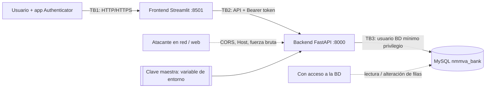

# NMMVA CORP — Modelo de Amenazas y Controles de Seguridad

**Marco:** STRIDE (modelado de amenazas) + MITRE ATT&CK + CIA+ + ITU-T X.800 + Defensa en Profundidad
**Rama de cambios:** `seguridad-stride` · **Fecha:** 29 de septiembre de 2026
**Estado de verificación:** 38 pruebas automatizadas en verde (14 unitarias, 23 de integración, 1 de migración), más un recorrido completo con la interfaz Streamlit real contra el backend real.

> Alcance: es un análisis y endurecimiento de un **prototipo académico**, no una auditoría ni un pentest independiente. Las limitaciones que quedan se listan con honestidad en la sección 11.

---

## 1. Resumen ejecutivo

Se revisó el código original (`main`) y se **reprodujeron** en ejecución 8 debilidades reales (sección 8). Las más graves:

1. Cualquiera, **sin credenciales**, podía obtener el secreto TOTP de otro usuario llamando a `POST /totp/setup/{id}` (los IDs son consecutivos).
2. La "firma digital" era `SHA-256("DOC:…|USER:…|TOTP_VERIFIED|NMMVA_CORP_2026")`: no usa ninguna clave secreta, así que **cualquiera puede calcularla**; no probaba nada.
3. Contraseñas con SHA-256 sin sal y sin política (se aceptó la contraseña `1`), secreto TOTP y CURP en claro en la base, y conexión a MySQL como `root` sin contraseña escrita en el código.
4. Sin límite de intentos: se hicieron 60 intentos de TOTP seguidos sin bloqueo.

Todo se corrigió y cada control tiene al menos una prueba automatizada. Se comprobó además, rompiendo a propósito 4 controles (bloqueo de cuenta, anti-repetición TOTP, alcance de tokens, verificación de la cadena de auditoría), que las pruebas **sí fallan** cuando el control no está.

---

## 2. Activos y fronteras de confianza

| Activo | Por qué importa |
|---|---|
| Credenciales (contraseña, secreto TOTP) | Su robo permite suplantar al cliente |
| CURP y datos personales | Datos personales sensibles (obligaciones de privacidad) |
| Contratos firmados y firma | Evidencia legal / No Repudio |
| Bitácora de auditoría | Evidencia forense y de responsabilidad |
| Claves del servidor (`NMMVA_MASTER_KEY`) | De ellas dependen cifrado, firma y tokens |



`TB1`, `TB2` y `TB3` son las fronteras de confianza: en cada una se validó, autenticó o limitó lo que cruza.

---

## 3. STRIDE — amenazas, controles y evidencia

Leyenda de prueba: `U` = `tests/test_security_units.py`, `I` = `tests/test_api_integracion.py`, `M` = `tests/test_migracion_legado.py`.

### S — Spoofing (suplantación)

| Amenaza (original) | Control implementado | Dónde | Prueba |
|---|---|---|---|
| El cliente enviaba `id_usuario` y el servidor le creía; cualquiera se hacía pasar por otro y leía su TOTP | La identidad sale **solo** del token JWT verificado; ya no existe `id_usuario` en URL ni cuerpo | `security/tokens.py`, `routes/*` | `I: test_la_identidad_sale_del_token…`, `test_endpoints_protegidos_exigen_token` |
| No existía login; solo registro y firma | `POST /login` con contraseña **+** TOTP; token de vida corta (15 min) | `routes/auth.py` | `I: test_login_exige_2fa…` |
| Un token de enrolamiento podía usarse para todo | Alcances separados: `enroll` (solo configurar 2FA) y `access` (firmar) | `security/tokens.py` | `I: test_token_de_enrolamiento_no_puede_firmar`, `U: test_token_enroll_no_sirve…` |
| Ataque `alg=none`, tokens expirados o de otra audiencia | Algoritmo fijo HS256, `iss`/`aud`/`exp` obligatorios | `security/tokens.py` | `U: test_token_rechaza_alg_none…` |
| Código TOTP interceptado reutilizable | Cada código sirve **una sola vez** (se guarda el último contador usado) | `security/totp_utils.py` | `U: test_totp_un_solo_uso…`, `I: test_totp_no_se_puede_reutilizar` |

### T — Tampering (manipulación)

| Amenaza | Control | Dónde | Prueba |
|---|---|---|---|
| Firma no ligada al contenido; editar el contrato en MySQL pasaba desapercibido | Firma **Ed25519** sobre `{sha256(documento), usuario, fecha UTC, nonce}`; `POST /verificar-firma` detecta cambios | `routes/signature.py`, `security/crypto.py` | `I: test_firma_ed25519_verificable_y_ligada_al_documento` |
| Editar o borrar filas de la bitácora | Cadena de HMAC: cada fila incluye el hash de la anterior; `GET /auditoria/verificar` señala la primera fila alterada | `security/audit.py` | `I: test_cadena_de_auditoria_detecta_edicion_y_borrado` |
| Entradas maliciosas o sin límite | Validación estricta (formatos, longitudes, `extra="forbid"`) | `models.py` | `I: test_registro_valida_formatos_y_campos_extra` |
| Inyección SQL | Consultas parametrizadas (ya lo estaban) — se verificó con una prueba | `routes/*` | `I: test_inyeccion_sql_no_tiene_efecto` |
| Migración de DDL en cada petición (alteraba el esquema en caliente) | Migraciones idempotentes una vez por proceso; en producción, aparte y con otra cuenta | `migrations.py`, `database.py` | `M` |

### R — Repudiation (repudio)

| Amenaza | Control | Dónde | Prueba |
|---|---|---|---|
| Un usuario niega haber firmado; el "certificado" lo podía fabricar cualquiera | Firma Ed25519 + contraseña + TOTP **nuevo por operación** + registro en bitácora encadenada | `routes/signature.py` | `I: test_la_firma_ya_no_es_calculable_por_un_tercero`, `test_firma_exige_totp_nuevo…` |
| Bitácora sin IP ni orden verificable | Cada evento guarda IP de origen, fecha UTC, severidad y su HMAC | `security/audit.py` | `I: test_cadena_de_auditoria…` |
| Inyección de líneas falsas en el log (`\n`) | Se neutralizan caracteres de control y se acota el tamaño | `security/audit.py` | `I: test_el_log_no_permite_inyeccion_de_lineas` |

### I — Information disclosure (fuga de información)

| Amenaza | Control | Dónde | Prueba |
|---|---|---|---|
| Secreto TOTP legible por cualquiera y guardado en claro | Cifrado en reposo (Fernet); tras confirmar el 2FA el secreto **no vuelve a mostrarse** (409) | `routes/totp.py`, `security/crypto.py` | `I: test_secreto_totp_cifrado_en_bd…` |
| CURP en claro | Cifrada en reposo + índice ciego (HMAC) para evitar duplicados sin guardarla en claro | `routes/auth.py`, `migrations.py` | `I: test_registro_guarda_hash_scrypt_y_curp_cifrada` |
| Errores de MySQL devueltos al cliente (`Duplicate entry 'v@x.com'…`) | Mensajes genéricos; el detalle solo va al log del servidor | `main.py`, `routes/auth.py` | `I: test_registro_duplicado_respuesta_generica` |
| Enumeración de usuarios (mensajes y tiempos distintos) | Mismo mensaje y mismo coste de cómputo si el usuario no existe o está bloqueado | `routes/auth.py`, `security/passwords.py` | `I: test_login_exige_2fa_y_no_revela…` |
| Pydantic reflejaba la contraseña en el error 422 | Manejador que omite el valor enviado | `main.py` | `I: test_registro_rechaza_contrasena_debil_sin_reflejarla` |
| `server: uvicorn`, `/test-db`, `/docs` visibles | Cabecera `server` oculta; `/test-db` solo en desarrollo; `/docs` apagado en producción | `run_backend.py`, `main.py` | verificado en ejecución |
| CORS `*` con credenciales | Solo el origen del frontend; métodos y cabeceras mínimos | `main.py` | `I: test_cors_solo_permite_el_frontend_legitimo` |
| Respuestas con tokens/secretos cacheables | `Cache-Control: no-store` y demás cabeceras de seguridad | `security/headers.py` | `I: test_cabeceras_de_seguridad…` |

### D — Denial of service (denegación de servicio)

| Amenaza | Control | Dónde | Prueba |
|---|---|---|---|
| Fuerza bruta / ráfagas de peticiones | Límite por IP: registro 5/min, login 10/min, 2FA 15/min, firma 10/min, consultas 20/min (HTTP 429 con `Retry-After`) | `security/rate_limit.py` | `U: test_limitador…`, `I: test_rate_limit_por_ip_en_login` |
| Bloqueo de cuentas ajenas a propósito | Bloqueo temporal (15 min tras 5 fallos) y mensaje uniforme; el bloqueo expira solo | `security/accounts.py` | `I: test_bloqueo_de_cuenta_por_fuerza_bruta` |
| Cuerpos gigantes / contraseñas de MB (scrypt es caro) | Longitudes máximas (contraseña 128, documento 255) | `models.py` | revisión de código |
| BD caída = petición colgada | `connection_timeout=5` y respuesta 503 genérica | `database.py` | revisión de código |
| Ráfagas paralelas para esquivar el contador | `SELECT … FOR UPDATE` serializa los intentos por cuenta | `security/accounts.py` | por diseño (no hay prueba de concurrencia) |

### E — Elevation of privilege (escalada de privilegios)

| Amenaza | Control | Dónde | Prueba |
|---|---|---|---|
| Backend conectado como `root` sin contraseña, escrito en el código | Credenciales por variables de entorno; producción **se niega a arrancar** con `root` o clave vacía; script de usuario de mínimo privilegio (bitácoras *append-only*) | `config.py`, `backend/sql/least_privilege.sql` | revisión de código y del SQL |
| Un usuario opera sobre otro (IDOR) | Todo se filtra por el `id` del token; `/verificar-firma` solo devuelve firmas propias | `routes/*` | `I: test_un_usuario_no_puede_verificar_firmas_de_otro` |
| Campos extra como `"rol":"admin"` | `extra="forbid"` | `models.py` | `I: test_registro_valida_formatos_y_campos_extra` |

---

## 4. MITRE ATT&CK — técnicas relevantes y su mitigación

Se mapearon las técnicas que aplican a una API bancaria con autenticación y base de datos. (Los identificadores siguen la matriz Enterprise; conviene contrastarlos con la versión vigente en attack.mitre.org antes de entregar.)

| Táctica | Técnica | Cómo aplicaba al proyecto | Mitigación ATT&CK | Control implementado | Detección |
|---|---|---|---|---|---|
| Credential Access | **T1110.001** Password Guessing / **T1110.003** Spraying / **T1110.004** Credential Stuffing | `/login` y `/totp/verify` sin límite de intentos | M1036 Account Use Policies, M1032 MFA | Bloqueo tras 5 fallos, límite por IP, mensaje uniforme | Eventos `WARN`/`ALERTA` en la bitácora |
| Credential Access | **T1110.002** Password Cracking (offline) | SHA-256 sin sal: el hash de `1` se rompía al instante | M1027 Password Policies | scrypt con sal por usuario, política de contraseñas NIST 800-63B | — |
| Credential Access | **T1111** MFA Interception | Un TOTP capturado se podía reutilizar | M1032 MFA | Código de un solo uso + TOTP nuevo por firma | Fallos "TOTP reutilizado" en bitácora |
| Credential Access | **T1528** Steal Application Access Token | (nuevo riesgo al introducir tokens) | M1036 | Tokens de 15 min, alcances, HS256 fijo | — |
| Credential Access | **T1552.001** Credentials In Files | `root` sin contraseña y `NMMVA_CORP_2026` en el código | M1026 Privileged Account Management | Secretos solo en variables de entorno; `.secrets/` en `.gitignore` | — |
| Initial Access | **T1078** Valid Accounts | Un TOTP robado + contraseña débil daba acceso legítimo | M1032, M1027 | MFA real en login y firma | Login exitoso/fallido con IP |
| Initial Access | **T1190** Exploit Public-Facing Application | Entrada sin validar, errores verbosos, `/docs` abierto | M1050 Exploit Protection (validación), M1048 Application Isolation | Validación estricta, consultas parametrizadas, errores genéricos | Logs del servidor |
| Discovery | **T1087** Account Discovery | IDs consecutivos, mensajes distintos por correo | M1018 User Account Management | Respuestas uniformes, IDs no aceptados del cliente | 409/401 genéricos |
| Collection | **T1213 / T1005** Datos en repositorios | Secretos TOTP y CURP en claro en la BD | M1041 Encrypt Sensitive Information | Cifrado de campos (Fernet) | — |
| Impact | **T1565.001** Stored Data Manipulation | Editar contratos o auditoría en MySQL | M1041, M1047 Audit | Firma Ed25519 ligada al documento + cadena HMAC | `verificar-firma`, `auditoria/verificar` |
| Impact | **T1657** Financial Theft | Objetivo final: firmar/operar como la víctima | M1032 | Firma con MFA por operación | Bitácora de firmas |
| Defense Evasion | **T1070** Indicator Removal | Borrar rastros en `logs_auditoria` | M1047, M1022 | Bitácora encadenada + permisos *append-only* | Cadena rota señala la fila |
| Impact | **T1499** Endpoint Denial of Service | Ráfagas contra endpoints costosos | M1037 Filter Network Traffic | Límite de tasa, tamaños máximos, timeouts | 429 registrados |
| Credential Access / Collection | **T1040** Network Sniffing y **T1557** Adversary-in-the-Middle | Tokens y contraseñas viajan por HTTP | M1041, M1030 | **Parcial:** HSTS y cabeceras; el TLS debe ponerlo un proxy (ver sección 11) | — |

---

## 5. CIA+

Se usó la extensión más habitual: la tríada CIA más **Autenticidad**, **No repudio** y **Responsabilidad (accountability)**. Si tu curso define "CIA+" de otra forma, la tabla se ajusta fácilmente.

| Propiedad | Objetivo | Controles |
|---|---|---|
| **Confidencialidad** | Solo quien debe ver los datos | Cifrado Fernet de TOTP y CURP; scrypt; secretos fuera del código; cabeceras `no-store`; respuestas sin detalle técnico; secreto TOTP no reexpuesto |
| **Integridad** | Los datos no se alteran sin que se note | Firma Ed25519 sobre hash del documento; cadena HMAC de auditoría; validación de entrada; consultas parametrizadas; cifrado autenticado (Fernet detecta alteraciones) |
| **Disponibilidad** | El servicio resiste abuso | Rate limiting, bloqueo temporal (no permanente), timeouts de BD, límites de tamaño, migraciones fuera del camino de cada petición |
| **Autenticidad** | Quien actúa es quien dice ser | Login con contraseña + TOTP; token con firma, audiencia y vigencia; TOTP de un solo uso |
| **No repudio** | El firmante no puede negar el acto | Firma Ed25519 + MFA por operación + registro con IP y hora UTC (con la limitación de la sección 11) |
| **Responsabilidad** | Cada acción es atribuible y auditable | Bitácora encadenada con usuario, IP y severidad; `GET /auditoria/verificar` |

---

## 6. ITU-T X.800

### 6.1 Servicios de seguridad (X.800 §5.2)

| Servicio X.800 | Implementación en el proyecto |
|---|---|
| **Autenticación de entidad par** | Login: contraseña + TOTP → token de acceso |
| **Autenticación del origen de datos** | Firma Ed25519 del servidor sobre cada contrato; JWT firmado en cada petición |
| **Control de acceso** | Alcances `enroll`/`access`; identidad tomada del token; propiedad de recursos (`/verificar-firma` solo del dueño); mínimo privilegio en MySQL |
| **Confidencialidad de datos** | *Selectiva por campo:* Fernet en TOTP y CURP. *En tránsito:* TLS requerido en producción (no incluido; sección 11) |
| **Integridad de datos** | Firma del contrato; cadena HMAC; cifrado autenticado |
| **No repudio (con prueba de origen)** | Firma Ed25519 + bitácora. *Prueba de entrega:* no aplica (no hay mensajería) |

### 6.2 Mecanismos (X.800 §6.2 y §6.3)

| Mecanismo | Estado | Dónde |
|---|---|---|
| Cifrado (*encipherment*) | Implementado | `security/crypto.py` (Fernet), scrypt |
| Firma digital | Implementado | Ed25519 en `routes/signature.py` |
| Control de acceso | Implementado | `security/tokens.py`, `backend/sql/least_privilege.sql` |
| Integridad de datos | Implementado | Hash SHA-256 del documento, cadena HMAC |
| Intercambio de autenticación | Implementado | `/login`, TOTP con anti-repetición |
| Relleno de tráfico (*traffic padding*) | No aplica | Fuera de alcance del prototipo |
| Control de encaminamiento | No aplica | Lo cubriría la red / proxy |
| Notarización | Parcial | Sello de tiempo UTC del servidor; no es una autoridad de sellado externa |
| Funcionalidad de confianza | Parcial | Claves derivadas por propósito (HKDF) |
| Detección de eventos | Implementado | Severidades `WARN` / `ALERTA` en bitácora |
| Pista de auditoría | Implementado | `auditoria_segura` (encadenada) + `logs_auditoria` (compatibilidad) |
| Recuperación de seguridad | No implementado | Sin restablecimiento de contraseña ni rotación de claves |

---

## 7. Defensa en profundidad

Ningún control aislado protege el sistema: cada amenaza principal está cubierta por **varias capas independientes**.

| Capa | Controles | Si esta capa falla, ¿qué sigue? |
|---|---|---|
| **1. Perímetro** | CORS restringido, `TrustedHost`, cabeceras de seguridad, límite por IP, `/docs` off en producción | Aún hay autenticación y validación |
| **2. Identidad** | Contraseña scrypt + TOTP de un solo uso, bloqueo por fallos, tokens de 15 min con alcance | Aún hay control de acceso por recurso y auditoría |
| **3. Aplicación** | Validación estricta, política de contraseñas, errores genéricos, identidad solo del token | Aún hay cifrado y permisos de BD |
| **4. Datos** | TOTP y CURP cifrados; contraseñas con scrypt; firma Ed25519 | Un volcado de la BD no expone secretos utilizables |
| **5. Base de datos / host** | Usuario de mínimo privilegio, bitácoras *append-only*, consultas parametrizadas, sin `root` | Aún se detecta la manipulación por la cadena HMAC |
| **6. Detección y respuesta** | Bitácora encadenada con IP y severidad, verificación de integridad, alertas de bloqueo | — |
| **7. Gestión** | Secretos en variables de entorno, `.gitignore`, pruebas automatizadas, este documento | — |

**Ejemplo de capas cooperando contra "robar el secreto TOTP":** (1) el límite por IP frena la enumeración; (2) sin token, `/totp/setup` responde 401; (3) el token solo da acceso al secreto **propio**; (4) una vez confirmado el 2FA, el secreto no se vuelve a mostrar; (5) en la BD está cifrado; (6) cualquier intento fallido queda registrado.

---

## 8. Evidencia antes / después

Ejecutado en este entorno con el código original (`main`) y con la rama `seguridad-stride`:

| # | Ataque | Original | Endurecido |
|---|---|---|---|
| 1 | Registrar contraseña `1` y CURP `cualquier cosa` | Aceptado (200) | 422: contraseña insegura / CURP de formato inválido, sin repetir el valor |
| 2 | Robar secreto TOTP de la víctima sin credenciales | `POST /totp/setup/1` devolvió el secreto | `/totp/setup/1` → 404; `/totp/setup` sin token → 401 |
| 3 | Lo que ve alguien con acceso a MySQL | `password_hash` SHA-256 sin sal, `totp_secret` y `curp` en claro | `scrypt$…` con sal; `enc1:…` en TOTP y CURP |
| 4 | Recuperar la contraseña del hash | El hash de `1` (`6b86b2…`) se conoce de inmediato | No recuperable por tablas: sal única + scrypt |
| 5 | Fuerza bruta de TOTP (60 intentos) | 60 × `401`, sin bloqueo | Bloqueo de cuenta al 5.º fallo (evento `ALERTA`) y `429` por IP a partir del 11.º/min |
| 6 | Forjar la "firma" de un contrato sin contraseña ni TOTP | Fórmula visible en el código → cualquiera calcula el valor | Firma Ed25519 con clave del servidor: no calculable por terceros |
| 7 | Correo duplicado | Respuesta con el error interno de MySQL | `409` genérico, sin revelar cuál dato existe |
| 8 | CORS desde `https://evil.com` | `allow-origin: https://evil.com` con `allow-credentials: true` | Sin cabecera `allow-origin` |

---

## 9. Registro de cambios

### Archivos nuevos
| Archivo | Propósito |
|---|---|
| `backend/app/config.py` | Configuración por entorno; clave maestra y derivación HKDF de claves por propósito |
| `backend/app/migrations.py` | Migraciones idempotentes; cifra una sola vez los datos heredados en claro |
| `backend/app/security/passwords.py` | scrypt, compatibilidad con SHA-256 heredado, política de contraseñas |
| `backend/app/security/crypto.py` | Fernet, índice ciego, firma Ed25519, HMAC de auditoría |
| `backend/app/security/tokens.py` | JWT con alcances (`enroll`, `access`) |
| `backend/app/security/totp_utils.py` | TOTP con anti-repetición |
| `backend/app/security/accounts.py` | Bloqueo de cuenta y consultas con `FOR UPDATE` |
| `backend/app/security/rate_limit.py` | Límite de tasa por IP |
| `backend/app/security/headers.py` | Cabeceras de seguridad |
| `backend/app/security/audit.py` | Bitácora encadenada y su verificación |
| `backend/app/routes/auditoria.py`, `routes/_comun.py` | Verificación de auditoría; utilidades comunes |
| `backend/sql/least_privilege.sql` | Usuario de BD de mínimo privilegio y bitácoras *append-only* |
| `tests/` (3 módulos + `conftest.py`) y `requirements-dev.txt` | 38 pruebas |
| `docs/SEGURIDAD.md` | Este documento |

### Archivos modificados
| Archivo | Cambio |
|---|---|
| `backend/app/main.py` | Middlewares, CORS restringido, manejadores de error, `/docs` y `/test-db` según entorno |
| `backend/app/database.py` | Credenciales por entorno, timeout, TLS opcional, `get_db`, migraciones una vez |
| `backend/app/models.py` | Validación estricta, política de contraseñas, `extra="forbid"`, sin `id_usuario` |
| `backend/app/routes/auth.py` | Registro seguro y **nuevo** `POST /login` |
| `backend/app/routes/totp.py` | `/totp/setup` y `/totp/verify` por token (sin ID en la URL) |
| `backend/app/routes/signature.py` | Firma Ed25519 + **nuevo** `POST /verificar-firma` |
| `frontend/*` | Cliente con tokens, login en el Paso 3, mensajes de error seguros, cierre de sesión que limpia tokens |
| `requirements.txt`, `.gitignore`, `run_backend.py` | `PyJWT`, `cryptography`; `.secrets/`, `*.key`; sin cabecera `server` |

### Cambios de comportamiento que el equipo debe conocer
- **Nuevo flujo de acceso:** Registro → configurar y confirmar 2FA → **iniciar sesión** (Paso 3) → firmar.
- **Códigos TOTP de un solo uso:** tras iniciar sesión hay que esperar al siguiente código (hasta 30 s) para firmar. Es intencional.
- **Endpoints que cambiaron:** `/totp/setup/{id}` → `/totp/setup` (con token); `/totp/verify` y `/firmar-contrato` ya no reciben `id_usuario`.
- **Contraseñas:** mínimo 12 caracteres.
- **Usuarios existentes:** siguen funcionando. Su hash SHA-256 se migra a scrypt en su primer login; su TOTP y CURP se cifran al arrancar (probado en `M`).
- Las firmas antiguas (SHA-256 sin clave) se conservan pero se reportan como **no verificables**.

---

## 10. Puesta en marcha

```powershell
pip install -r requirements.txt
python run_backend.py      # Terminal 1 (migra el esquema al arrancar)
python run_frontend.py     # Terminal 2
```

**Antes de ejecutar sobre tu base real, haz un respaldo** (`mysqldump nmmva_bank > respaldo.sql`): la migración altera columnas y cifra datos.

| Variable | Uso | Desarrollo |
|---|---|---|
| `NMMVA_ENV` | `production` activa las salvaguardas estrictas | `development` (defecto) |
| `NMMVA_MASTER_KEY` | Clave maestra (≥ 32 caracteres) | Se genera en `.secrets/master.key` |
| `NMMVA_DB_USER` / `NMMVA_DB_PASSWORD` / `NMMVA_DB_HOST` / `NMMVA_DB_NAME` | Conexión a MySQL | `root` / vacío / `localhost` / `nmmva_bank` |
| `NMMVA_CORS_ORIGINS`, `NMMVA_ALLOWED_HOSTS` | Orígenes y hosts permitidos | Streamlit local y `localhost` |
| `NMMVA_API_URL` (frontend) | URL de la API | `http://127.0.0.1:8000` |
| `NMMVA_DB_SSL_CA`, `NMMVA_RUN_MIGRATIONS`, `NMMVA_TOKEN_TTL_MIN`, `NMMVA_MAX_FAILED`, `NMMVA_LOCK_MIN` | Ajustes opcionales | ver `config.py` |

**Advertencia sobre la clave maestra:** si pierdes `.secrets/master.key` (o cambias `NMMVA_MASTER_KEY`), los datos cifrados **no se pueden recuperar** y las firmas anteriores dejarán de validar. Respáldala fuera del repositorio.

**Pruebas:** `pip install -r requirements-dev.txt` y luego `pytest`. Crean su propia base `nmmva_bank_test` (necesitan permiso para crearla; con XAMPP y `root` funcionan tal cual) y **no tocan tus datos**.

**Producción:** definir `NMMVA_ENV=production`, ejecutar `backend/sql/least_privilege.sql`, correr `python -m backend.app.migrations` con la cuenta *migrator* y arrancar la app con la cuenta *app*.

---

## 11. Riesgos residuales y limitaciones (sin maquillaje)

1. **No repudio "fuerte" no logrado.** La clave de firma vive en el servidor: el banco podría, en teoría, firmar en nombre del usuario. Un no repudio con validez legal exige una clave privada **en poder del usuario** (WebAuthn/PKI, e.firma) y sellado de tiempo de un tercero. Lo implementado es evidencia sólida de integridad y de autenticación multifactor, no sustituye a una firma electrónica avanzada.
2. **Sin TLS incluido.** En local la API va por HTTP: contraseñas y tokens viajan sin cifrar por el *loopback*. En cualquier despliegue real debe ponerse un proxy inverso con HTTPS; la app solo emite HSTS en producción.
3. **Los JWT no se pueden revocar antes de expirar** (15 min). "Cerrar sesión" borra el token del cliente, no lo invalida en el servidor.
4. **Límite de tasa en memoria y por proceso.** Con varios procesos o detrás de un proxy hay que moverlo a Redis o al *gateway*.
5. **Truncado de la bitácora:** la cadena detecta ediciones, borrados intermedios y reordenamientos, pero no que se eliminen las **últimas** filas, salvo que se guarde `ultimo_hash` fuera de la BD.
6. **Sin roles.** `/auditoria/verificar` lo puede consultar cualquier usuario autenticado; en un sistema real sería de un auditor.
7. **Gestión de claves básica:** una sola clave maestra en archivo/variable, sin rotación ni KMS, en el mismo host que la base.
8. **Faltan funciones de un banco real:** restablecimiento de contraseña, verificación de correo, cierre de sesión global, WAF, análisis de dependencias (`pip-audit`), escaneo SAST/DAST.
9. **Datos personales:** la CURP está cifrada, pero el tratamiento de datos personales tiene obligaciones legales adicionales (aviso de privacidad, derechos ARCO) que no cubre este documento ni es asesoría legal.
10. Los mensajes de validación de Pydantic salen en inglés para algunos campos (p. ej. la longitud de la CURP).

---

## 12. Referencias

- Microsoft. *STRIDE* (Threat Modeling).
- MITRE. *ATT&CK Enterprise Matrix* — attack.mitre.org.
- ITU-T Recommendation **X.800** (1991), *Security architecture for Open Systems Interconnection*.
- NIST SP 800-63B, *Digital Identity Guidelines — Authentication and Lifecycle Management*.
- OWASP *Password Storage Cheat Sheet*; OWASP ASVS.
- RFC 6238 (TOTP), RFC 8032 (Ed25519), RFC 7519 (JWT).
